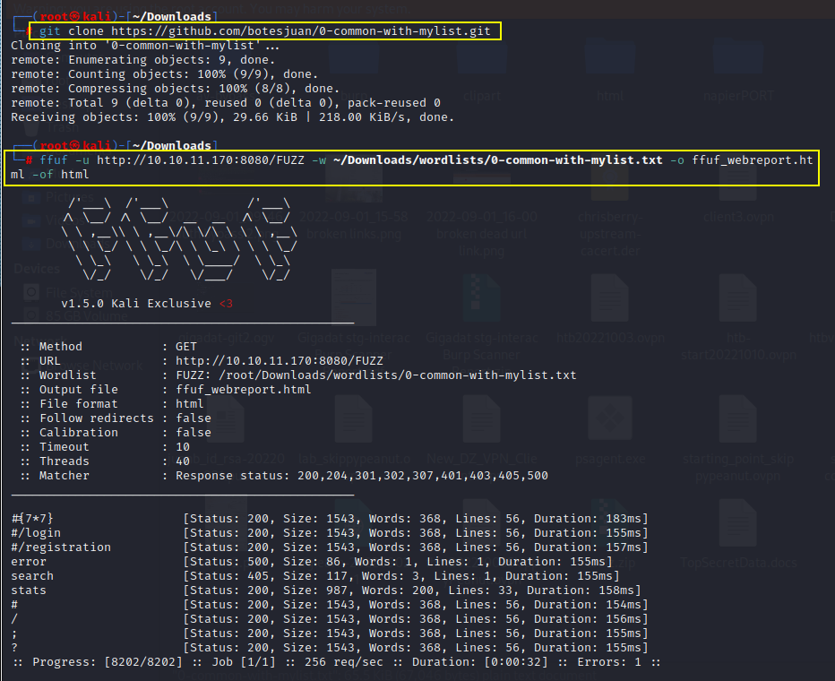

# 0-common-with-mylist Wordlist Usage
This is short wordlist I maintain, original from the common wordlist but with few added words of my own used for web fuzzing.

Download clone to Linux host:
```bash
sudo git clone https://github.com/botesjuan/0-common-with-mylist.git
```

Here is example how to use it with FFUF:
```bash
ffuf -u https://10.10.11.170:8080/FUZZ -w ~/Downloads/wordlists/0-common-with-mylist.txt -o ffuf_webreport.html -of html
```

