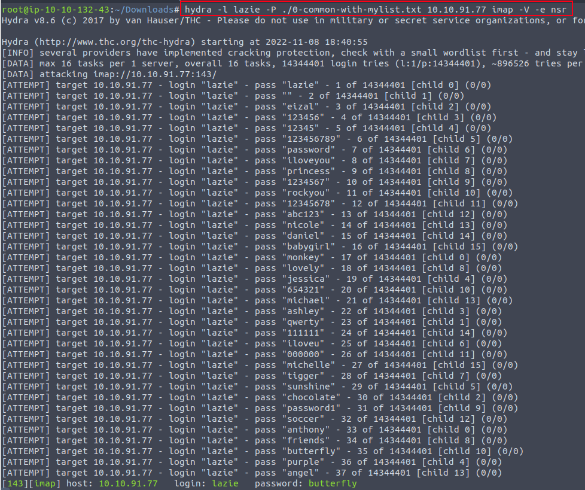

# 0-common-with-mylist Wordlist Usage
This is short wordlist I maintain, original from the common wordlist but with few added words of my own used for web fuzzing.

Download clone to Linux host:
```bash
sudo git clone https://github.com/botesjuan/0-common-with-mylist.git
```

Here is example how to use wordlist with FFUF:  
```bash
ffuf -u https://10.10.11.170:8080/FUZZ -w ~/Downloads/wordlists/0-common-with-mylist.txt -o ffuf_webreport.html -of html
```


Here is example how to use the wordlist with HYDRA to bruteforce IMAP user password, and also using the e flag switch to tell Hydra to test the username in 3 ways as possible password:  
```bash
hydra -l lazie -P /usr/share/wordlists/rockyou.txt 10.10.91.77 imap -V -e nsr
```

